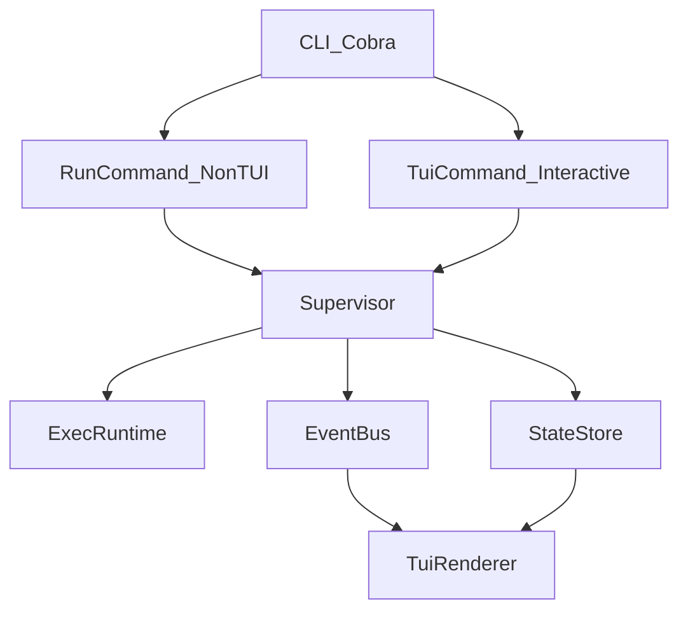

# imux architecture and process model

This document defines the baseline architecture for `imux` and serves as the
contract for follow-on MVP tasks.

## Goals

- Support two execution surfaces:
  - interactive TUI mode (`imux tui`)
  - regular non-TUI CLI mode (`imux run ...`)
- Keep process control independent from presentation so both surfaces share one
  backend lifecycle model.
- Define failure-handling and restart behavior up front to avoid ambiguity in
  later process-control and output-multiplexing work.

## High-level architecture

### Responsibilities

- CLI (`internal/cli`):
  - Parse commands and flags with Cobra.
  - Choose mode (`run` vs `tui`).
  - Translate CLI input into backend requests.
- Supervisor (`internal/core`):
  - Own process registration/start/stop/restart decisions.
  - Emit lifecycle events.
  - Maintain process-state transitions in the state store.
- Runtime adapter (future implementation):
  - Start/monitor OS commands.
  - Report exit and signal outcomes back to supervisor.
- TUI (future implementation):
  - Subscribe to event/state feeds.
  - Render process list/log panes and dispatch user intents.

## Process model

Each managed process is defined by `ProcessSpec`:

- identity: stable process ID and display name
- command spec: command string, args, env, working directory
- restart config: restart policy and optional restart-attempt cap

Lifecycle states:

- `pending` -> `starting` -> `running` -> `stopping` -> `exited`
- `running|starting|stopping` -> `failed`

Illegal transitions are ignored by the state transition helper and should emit
an operator-facing warning in later implementations.

## Failure-handling and restart semantics

Restart policy values:

- `never`: never restart after exit/failure
- `on_failure`: restart only on failed or signaled exits
- `always`: restart on all exits except explicit operator-requested shutdown

Additional restart rules:

- Explicit user stop (`ExitReasonRequested`) is terminal and does not restart,
  even under `always`.
- `MaxRestarts` limits retries when >0 (0 means unlimited).
- When restart limit is reached, process remains terminal (`failed` or `exited`)
  and a lifecycle event should report suppression reason.

## CLI mode boundaries

### Non-TUI mode (`imux run`)

- Must execute without initializing alt-screen rendering.
- Intended for scriptable workflows, CI usage, and shell-centric operation.
- Command/flag surface follows the ergonomics of `multirun` in `gastrolog`
  where practical (`--name`, `--grace`, `--no-fail-fast`, `--tee`).

### TUI mode (`imux tui`)

- Initializes interactive renderer and keyboard/mouse command handling.
- Shares the same supervisor/event/state contracts as non-TUI mode.

## Follow-on implementation contract

Blocked issues can proceed assuming these contracts:

- `imux-67o7`: builds renderer against `EventBus` + `StateStore`.
- `imux-3d4f`: implements runtime-backed supervisor methods.
- `imux-2oco`: adds dynamic creation via supervisor register/start APIs.
- `imux-1xp2`: adds process inspection against state snapshots/events.
- `imux-38oz`: implements stream-aware logging under same event model.
